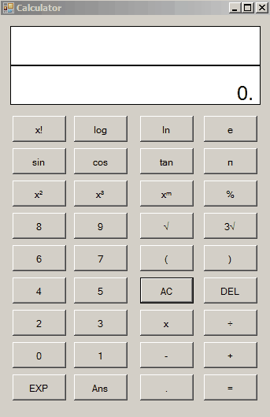

<h1 align="center">Calculator made with Visual Basic</h1>

  

## Requeriments

-   Visual Studio **IDE**.
-   `.NET` Framework `4.6`.

## Installation

1.   Clone th repo.
2.   Open the project, compile and execute in Visual Studio.
